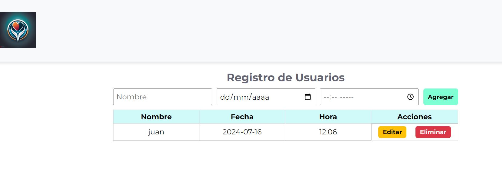

## CRUD

CRUD hace referencia a un acrónimo de "Create, Read, Update and Delete" que en español significa "Crear, Leer, Actualizar y Borrar" que son las cuatro funciones básicas de la persistencia de Bases de Datos.

CRUD se usa también a veces para describir convenciones de interfaz de usuario que facilita la vista, búsqueda y modificación de la información; a menudo se usa en programación de formularios (forms) e informes (reports).

Ingrese al ejemplo de aplicación

https://main--crudapp1jh.netlify.app/

### Funcionamiento
Así es como se verá cuando ingresemos una serie datos.

